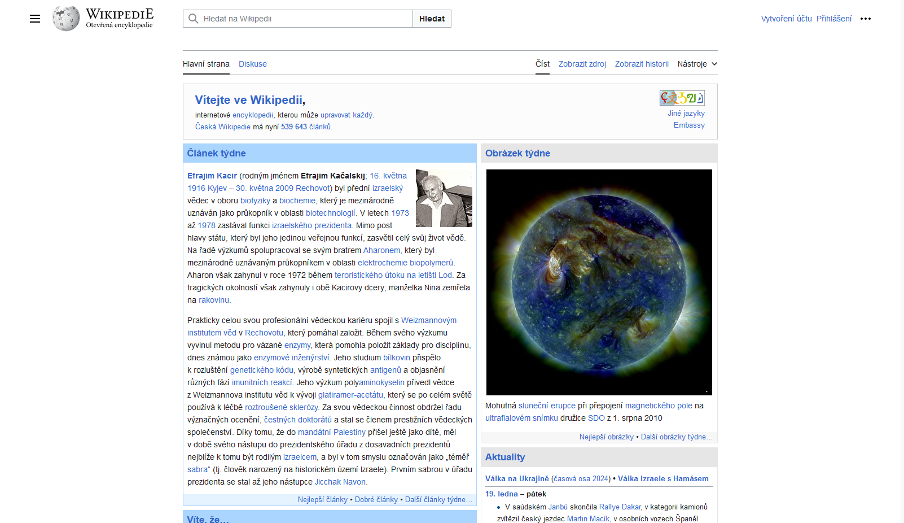

# Random Wikipedia walker

Using Selenium, create a small program that, starting from the main page https://www.wikipedia.org/, walks trough a sequence of random links and takes a snapshot of the last page.
The process is as follows:

 1. Navigate to the main page https://www.wikipedia.org/
 2. Select a random link in the page
 3. Navigate to the link
 4. Repeat steps 2 to 3 until you have visited 10 different pages
 5. Take a snapshot of the current page and save it

Include the code of the walker and the snapshot in this document.

## Answer

```java
package org.example;

import org.openqa.selenium.By;
import org.openqa.selenium.OutputType;
import org.openqa.selenium.TakesScreenshot;
import org.openqa.selenium.WebDriver;
import org.openqa.selenium.firefox.FirefoxDriver;

import java.io.File;
import java.io.IOException;
import java.nio.file.Files;
import java.nio.file.Paths;
import java.nio.file.StandardCopyOption;
import java.util.List;
import java.util.Random;
import java.util.stream.Collectors;

public class WikipediaWalker {

    private final WebDriver driver;

    public WikipediaWalker() {
        driver = new FirefoxDriver();
    }
    
    public void start(int numberOfStep) {
        driver.get("https://fr.wikipedia.org/wiki/Wikip%C3%A9dia:Accueil_principal");
        for (int i = 0; i < numberOfStep; i++) {
            String randomLink = getRandomLink();
            driver.get(randomLink);
        }
        takeScreenshot();
        driver.quit();
    }

    private String getRandomLink() {
        Random random = new Random();
        List<String> links = driver.findElements(By.tagName("a"))
                .stream()
                .filter(l -> !l.getAttribute("href").isBlank())
                .map(l -> l.getAttribute("href"))
                .collect(Collectors.toList());

        return links.get(random.nextInt(links.size()));
    }

    private void takeScreenshot() {
        File screenshotFile = ((TakesScreenshot) driver).getScreenshotAs(OutputType.FILE);
        try {
            Files.move(screenshotFile.toPath(), Paths.get("screenshot.png"), StandardCopyOption.REPLACE_EXISTING);
        } catch (IOException e) {
            System.err.println("Failed to save screenshot: " + e.getMessage());
        }
    }

    public static void main(String[] args) {
        WikipediaWalker walker = new WikipediaWalker();
        walker.start(5);
    }
}
```


